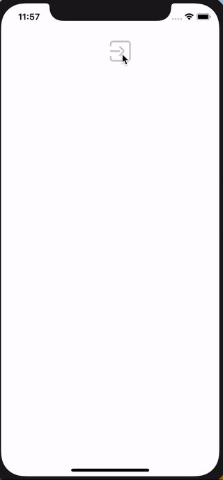

# ConsoleLog

[](https://cocoapods.org/pods/ConsoleLog)
[](https://cocoapods.org/pods/ConsoleLog)
[](https://cocoapods.org/pods/ConsoleLog)
[](https://developer.apple.com/swift/)

## Introduce

You can easily create and view logs.



## Requirements

`ConsoleLog` written in Swift 4. Compatible with iOS 8.0+

## Installation

### Cocoapods

Tags is available through [CocoaPods](http://cocoapods.org). To install
it, simply add the following line to your Podfile:

```ruby
pod 'ConsoleLog'
```

## Usage

### Code editor

```swift
import ConsoleLog
```

```swift
ConsoleLog.shared.show()
```

done!

<br><br><br>

write
ㅑ```swift
ConsoleLog.shared.custom(level: ConsoleLog.Level, message: Any)
ConsoleLog.shared.verbose(_ message: Any)
ConsoleLog.shared.debug(_ message: Any)
ConsoleLog.shared.info(_ message: Any)
ConsoleLog.shared.warning(_ message: Any)
ConsoleLog.shared.error(_ message: Any)
```

remove

```swift
ConsoleLog.shared.remove()
```

show & hide

```swift
ConsoleLog.shared.show()
ConsoleLog.shared.hide()
```

get

```swift
// [ConsoleVO]
ConsoleLog.shared.readArray
// String
ConsoleLog.shared.read
// [ConsoleVO]
ConsoleLog.shared.todayReadArray
// String
ConsoleLog.shared.todayRead
```

<br><br>

### Customize

```swift
ConsoleLog.consoleOptions

// MARK: LevelString
public struct LevelString {
    var verbose = "💜 VERBOSE"
    var debug = "💚 DEBUG"
    var info = "💙 INFO"
    var warning = "💛 WARNING"
    var error = "❤️ ERROR"
    var verboseColor = UIColor(red: 173/255, green: 58/255, blue: 243/255, alpha: 1)
    var debugColor = UIColor(red: 64/255, green: 198/255, blue: 41/255, alpha: 1)
    var infoColor = UIColor(red: 9/255, green: 99/255, blue: 246/255, alpha: 1)
    var warningColor = UIColor(red: 252/255, green: 210/255, blue: 62/255, alpha: 1)
    var errorColor = UIColor(red: 255/255, green: 55/255, blue: 43/255, alpha: 1)
}

// MARK: NavigationOptions
public struct NavigationOptions {
    var barColor = UIColor(white: 230/255, alpha: 1)
    var barTintColor = UIColor.black
}

// MARK: WebViewOptions
public struct WebViewOptions {
    var backgroundColor = UIColor.black
    var textColor = UIColor(red: 192/255, green: 192/255, blue: 186/255, alpha: 1)
    var fontSize: CGFloat = 10
}

// MARK: InfoOptions
public struct InfoOptions {
    var isLanguage = true
    var isPreferredLanguages = true
    var isLocale = true
    var isVersion = true
    var isBulid = true
    var isUUID = true
    var addText = ""
}

// MARK: ConsoleLogTitle
public struct ConsoleLogTitle {
    var todayLog = "Today Log"
    var log = "All Log"
    var info = "Info"
}

// MARK: ConsoleOptions
public struct ConsoleOptions {
    var levelString = LevelString()
    var naviagationOptions = NavigationOptions()
    var webViewOptions = WebViewOptions()
    var consoleLogTitle = ConsoleLogTitle()
    var infoOptions = InfoOptions()
    var dateFormat = "yyyy-MM-dd HH:mm:ss"
    var line = "------------------------------------------------------------"
    var ascending = false
}

```

## Author

pikachu987, pikachu77769@gmail.com

## License

ConsoleLog is available under the MIT license. See the LICENSE file for more info.
